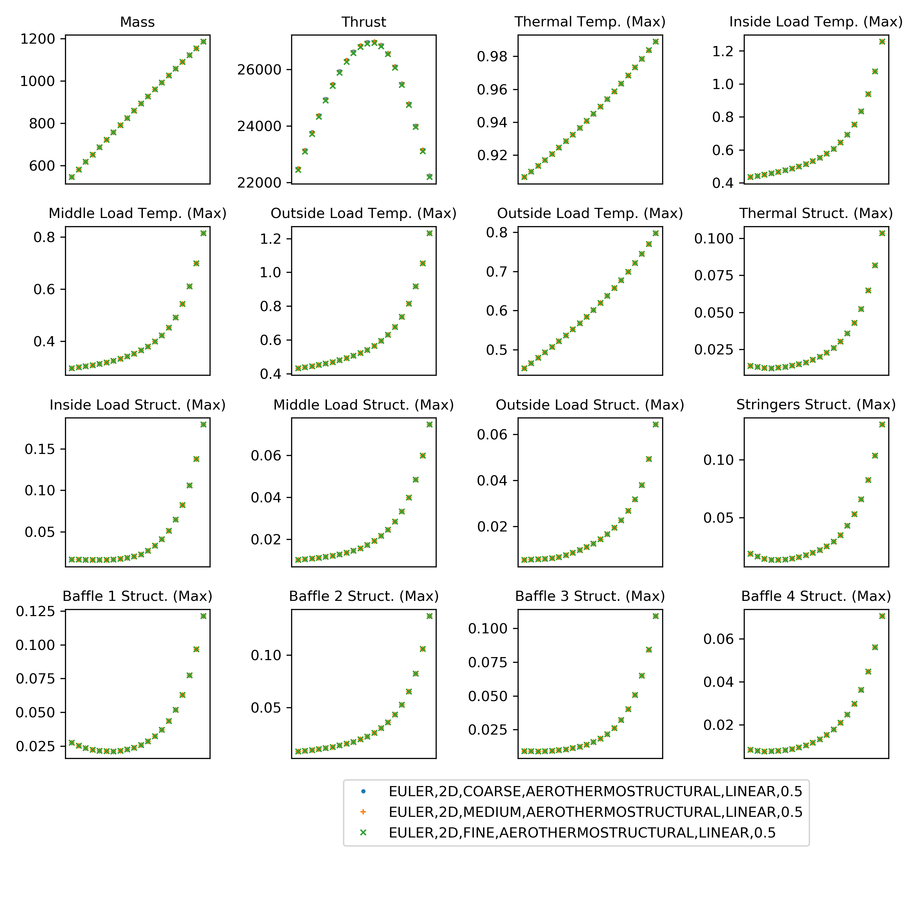
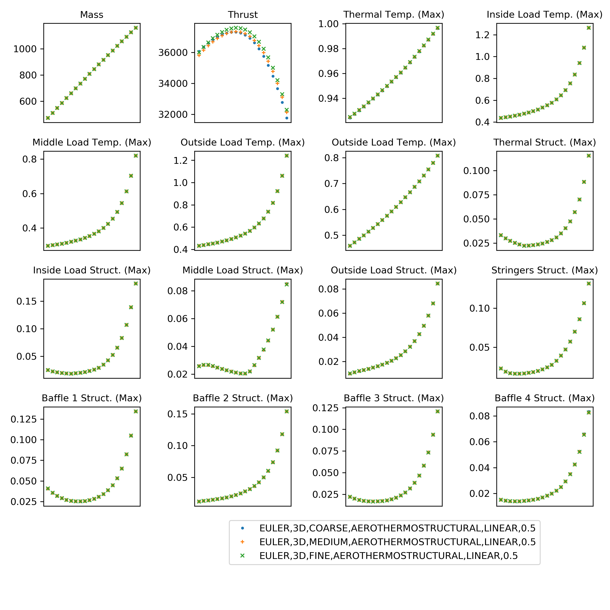
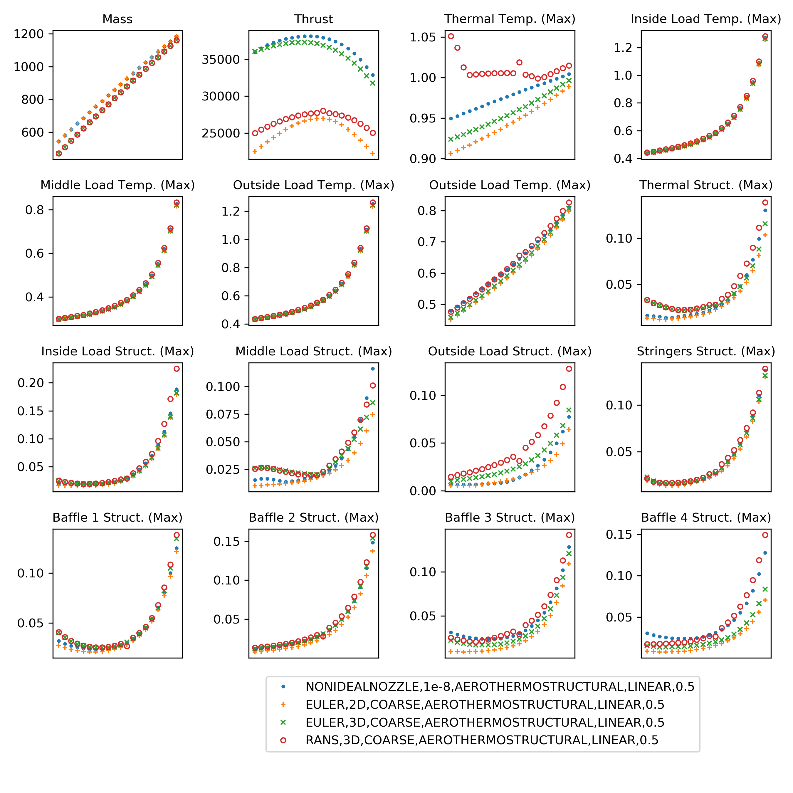

# Status Report on MULTI-F v22

## Good Correlation Between Different Meshes at Same Fidelity
Looking at the sweeps, we see similar values for each QoI 
for coarse, medium, and fine meshes for 2D and 3D Euler.

## Substantial Differences Between Fidelities
However in some QoIs, notably thrust and Thermal Temperature,
we see substantial deviation between the sweeps. 

To quantify how apart the various models are, 
the plot below shows the maximum difference 
between the output of each QoI normalized by the
difference between the smallest and largest value for each QoI.
Note that as suggested by the plots above, for the same physics model
(2D Euler (2,3,4) and 3D Euler (5,6,7)) the maximum mismatch is small.

The numbers above denote the level in MULTI-F:

0. 1D, Linear
1. 1D, Nonlinear
2. 2D Euler, coarse
3. 2D Euler, medium
4. 2D Euler, fine
5. 3D Euler, coarse
6. 3D Euler, medium
7. 3D Euler, fine
11. 3D RANS, coarse  

## Computational Cost of Each Level

level | description | min runtime (1 CPU) | max runtime (1 CPU) |
------|-------------|---------------------|---------------------|
0     | 1D Linear   | 2.5 minutes         | 4 minutes           |
1     | 1D Nonlinear| 2.7 minutes         | 4 minutes           |
2     | 2D Euler Coarse   | 3 minutes   |  5 minutes          |
3     | 2D Euler Medium   | 5 minutes   | 8 minutes  |
4     | 2D Euler Fine     | 10 minutes  | 14 minutes |
5     | 3D Euler Coarse   | 15 minutes  | 71 minutes |
6     | 3D Euler Medium   | 40 minutes  | 3.1 hours  |
7     | 3D Euler Fine     | 2.2 hours   | 9.1 hours  |
11    | 3D RANS Coarse    | 16 hours    | 24.9 hours |
13    | 3D RANS Fine      | 90 hours (3.7 days) | 108 hours (4.5 days) |
